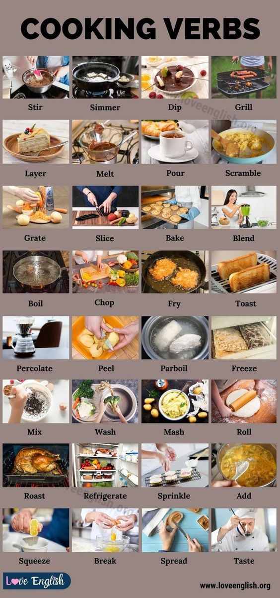

[Back to Contents](../README.md)

<h1 style="text-align: center;">COOKING</h1>

### stir(verb) : 攪拌

### simmer(verb) : 文火慢煮

### dip(verb) : 將食材浸入液體中

### grill(verb) : 在高溫中，將食物放在烤架上加熱; 烤

### layer(verb) : 「分層」，「疊層」，把不同的食材一層一層地堆疊起來

### melt(verb) : 融化，溶解

### pour(verb) : 倒

### scramble(verb) : 炒，通常指的是把雞蛋或其他食材攪拌後，在平底鍋中翻炒至熟

### grate(verb)：刨

### slice(verb)：切片

### bake(verb)：烘焙，烤，通常指的是將食物放入烤箱中，以乾熟的方式烹調

### blend(verb)：攪拌，混合

### boil(verb)：煮沸，煮，把液體加熱到沸騰，並讓食物在其中烹調

### chop(verb)：切碎，剁

### fry(verb)：煎，炸，把食材放在熱油中烹調

### toast(verb)：烘烤，烤，通常指的是把麵包放入烤箱或烤麵包機中加熱，直到表面變得金黃酥脆

### percolate(verb)：滲透，過濾

### peel(verb)：剝皮，去皮

### parboil(verb)：to boil food, especially vegetables, until it is partly cooked

### freeze(verb)：冷凍，冰凍

### mix(verb)：混合，攪拌

### wash(verb)：洗

### mash(verb)：搗碎，碾碎

### roll(verb)：擀，捲，通常指的是用擀麵杖將麵團擀成所需的形狀和厚度，或者將食材捲起來

### roast(verb)：烤，焙，通常指的是在烤箱或明火上以乾熱的方式長時間烹調食材，使其外部熟得金黃酥脆，內部熟透

### refrigerate(verb)：冷藏

### sprinkle(verb)：撒，灑，通常指的是將食材(例如鹽、糖或香料)均勻地撒在另一種食物上

### add(verb)：加入，添加

### squeeze(verb)：擠，壓

### break(verb)：打破，弄碎

### spread(verb)：塗抹，抹開，通常指的是將一種食材均勻地塗在另一種食材上

### taste(verb)：通常指的是試吃食物，以確定其味道和調味是否合適

### 
